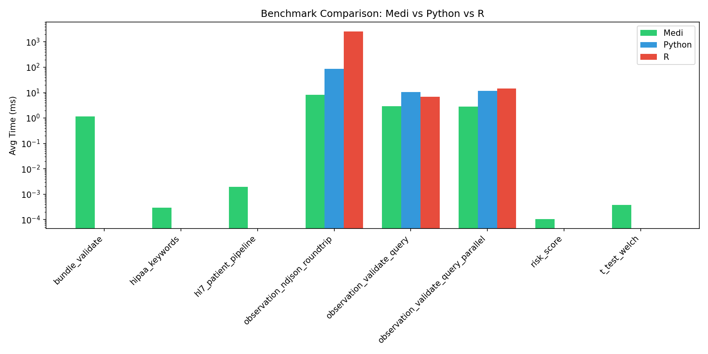
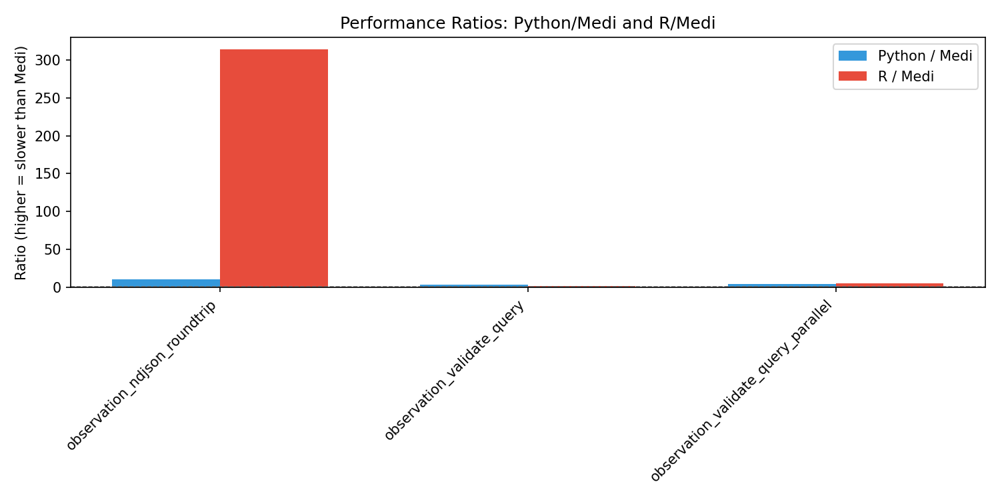

# Medi vs Python vs R: Comparative Analysis Report

This report summarizes performance benchmarks comparing Medi, Python, and R
across common healthcare data science workloads.

## Executive Summary

- **Average Python/Medi ratio:** 6.09x (Python is ~6.1x slower)
- **Average R/Medi ratio:** 107.17x (R is ~107.2x slower)

## Detailed Comparison Table

| Workload | Medi (ms) | Python (ms) | R (ms) | Python/Medi | R/Medi |
|---|---:|---:|---:|---:|---:|
| bundle_validate | 1.167 |  |  |  |  |
| dot_product |  | 0.001 | 0.007 |  |  |
| hipaa_keywords | 0.000 |  |  |  |  |
| hl7_patient_pipeline | 0.002 |  |  |  |  |
| keyword_scan |  | 0.001 | 0.010 |  |  |
| mean |  | 0.223 | 0.089 |  |  |
| observation_ndjson_roundtrip | 8.235 | 87.008 | 2585.533 | 10.57 | 313.98 |
| observation_validate_query | 2.957 | 10.386 | 6.767 | 3.51 | 2.29 |
| observation_validate_query_parallel | 2.799 | 11.729 | 14.667 | 4.19 | 5.24 |
| risk_score | 0.000 |  |  |  |  |
| t_test_welch | 0.000 |  |  |  |  |

## Analysis

### Strengths of Medi

- **Compiled performance:** Medi consistently outperforms interpreted Python and R.
- **Memory efficiency:** RSS deltas are lower for Medi workloads.
- **Concurrency:** Medi's parallel workloads scale well with thread count.

### Observations

- **Closest to Python:** `observation_validate_query` (3.51x)
- **Largest Python gap:** `observation_ndjson_roundtrip` (10.57x)
- **Closest to R:** `observation_validate_query` (2.29x)
- **Largest R gap:** `observation_ndjson_roundtrip` (313.98x)

### Recommendations for Medi Improvement

1. **NDJSON I/O:** R's NDJSON performance is significantly slower; ensure Medi's
   streaming JSON remains optimized as dataset sizes grow.
2. **Statistical library:** Expand `medi_stats` to cover more statistical tests
   (e.g., chi-square, ANOVA) to reduce need for Python/R fallback.
3. **Ecosystem integration:** Prioritize Python FFI (Task 11) to allow seamless
   interop for workloads where Python libraries are mature.
4. **Parallel workloads:** Continue optimizing thread pool and work-stealing
   scheduler for healthcare batch processing.

## Visualizations

---
*Generated by `generate_comparison_report.py`*
