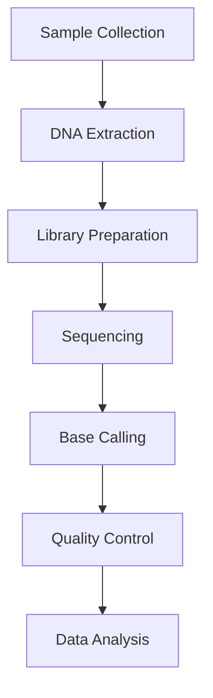

# MediLang Glossary

This glossary provides explanations of healthcare and bioinformatics-related terms that developers might encounter while working with MediLang. Each section includes relevant resources, citations, and practical examples for better understanding.

## Healthcare Data Standards

### FHIR (Fast Healthcare Interoperability Resources)
A modern standard for exchanging healthcare information electronically. FHIR combines the best features of HL7's v2, v3, and CDA while leveraging current web technologies.

**Key Features:**
- RESTful API architecture
- JSON, XML, and RDF formats
- Modular components called "Resources"
- Human-readable base schemas
- Strong focus on implementability

**Example FHIR Resource (Patient in JSON):**
```json
{
  "resourceType": "Patient",
  "id": "example",
  "active": true,
  "name": [{
    "use": "official",
    "family": "Smith",
    "given": ["John", "Edward"]
  }],
  "gender": "male",
  "birthDate": "1974-12-25",
  "address": [{
    "use": "home",
    "line": ["123 Healthcare Street"],
    "city": "Ann Arbor",
    "state": "MI",
    "postalCode": "48105"
  }]
}
```

**Example FHIR API Endpoints:**
```
GET  /Patient/[id]           # Get specific patient
POST /Patient               # Create new patient
GET  /Patient?name=Smith    # Search patients by name
GET  /Observation?patient=[id] # Get patient's observations
```

**Resources:**
- [Official FHIR Documentation](https://hl7.org/fhir/)
- [FHIR for Developers](https://build.fhir.org/)
- [SMART on FHIR](https://docs.smarthealthit.org/)

### HL7 (Health Level Seven)
The global authority on standards for interoperability of health technology, producing healthcare data exchange and information modeling standards.

**Versions:**
- **HL7 v2.x**: Legacy message-based standard using pipe-delimited syntax

**Example HL7 v2 Message (ADT-A01 Patient Admission):**
```
MSH|^~\&|SENDING_APP|SENDING_FAC|RECEIVING_APP|RECEIVING_FAC|20230401123045||ADT^A01|MSG00001|P|2.3
EVN|A01|20230401123045
PID|1||12345^^^MRN||SMITH^JOHN^E||19741225|M|||123 HEALTHCARE ST^^ANN ARBOR^MI^48105
NK1|1|SMITH^JANE^|SPOUSE|734-555-0123
PV1|1|I|2000^2012^01||||0123^WATSON^ROBERT|||||||||V|||||||||||||||||||||||||20230401123045
```

**Example HL7 v3 Message (Same admission in XML):**
```xml
<ADT_A01 xmlns="urn:hl7-org:v3">
  <id root="2.16.840.1.113883.19.3.2409" extension="MSG00001"/>
  <creationTime value="20230401123045"/>
  <patient>
    <name>
      <given>John</given>
      <family>Smith</family>
    </name>
    <administrativeGenderCode code="M"/>
    <birthTime value="19741225"/>
  </patient>
</ADT_A01>
```
- **HL7 v3**: XML-based standard with Reference Information Model (RIM)
- **CDA**: Clinical Document Architecture for clinical documents

**Resources:**
- [HL7 Standards](https://www.hl7.org/implement/standards/)
- [HL7 v2 to FHIR](https://build.fhir.org/ig/HL7/v2-to-fhir/)

## Genomics File Formats

### FASTQ
A text format that stores both biological sequences and their quality scores. Essential in modern high-throughput sequencing workflows.

**Format Structure:**
```
@SEQ_ID                 # Sequence identifier
GATTTGGGGTTCAAAGCAG    # Raw sequence
+                      # Separator line
!''*((((***+))%%%++   # Quality scores (ASCII-encoded)
```

**Example FASTQ Entry (Illumina Format):**
```
@SRR001666.1 071112_SLXA-EAS1_s_7:5:1:817:345 length=36
GATTACGAATGCTAGGTCGGATCTGAGGCAATGTG
+
!''*(((((***+))%%%++)(%%%%).1***-+*''
```

**Quality Score Interpretation:**
```python
# Phred+33 encoding (Illumina 1.8+)
def qual_to_prob(ascii_char):
    """Convert ASCII quality char to error probability"""
    phred = ord(ascii_char) - 33
    error_prob = 10 ** (-phred/10)
    return error_prob

# Example
print(qual_to_prob('!'))  # Lowest quality (Q=0)
print(qual_to_prob('I'))  # High quality (Q=40)
```

**Resources:**
- [FASTQ Format Specification](https://support.illumina.com/help/BaseSpace_OLH_009008/Content/Source/Informatics/BS/FileFormat_FASTQ-files_swBS.htm)
- [Quality Score Encoding](https://support.illumina.com/help/BaseSpace_OLH_009008/Content/Source/Informatics/BS/QualityScoreEncoding_swBS.htm)

### VCF (Variant Call Format)
The standard format for storing DNA sequence variations. Critical for genomic medicine and population genetics studies.

**Example VCF File:**
```
##fileformat=VCFv4.3
##reference=GRCh38
##INFO=<ID=AF,Number=A,Type=Float,Description="Allele Frequency">
##FORMAT=<ID=GT,Number=1,Type=String,Description="Genotype">
#CHROM  POS     ID      REF     ALT     QUAL    FILTER  INFO    FORMAT  SAMPLE1 SAMPLE2
20      14370   rs6054257    G       A       29      PASS    AF=0.5  GT      0/1     1/1
20      17330   .           T       A       3       q10     AF=0.017 GT      0/0     0/1
```

**Common Operations with VCF:**
```bash
# Filter variants by quality using bcftools
bcftools filter -i 'QUAL>20' input.vcf > high_quality.vcf

# Extract SNPs only
bcftools view -v snps input.vcf > snps_only.vcf

# Calculate allele frequencies
bcftools +fill-tags input.vcf -- -t AF
```

**Resources:**
- [VCF 4.3 Specification](https://samtools.github.io/hts-specs/VCFv4.3.pdf)
- [VCF Guide by GATK](https://gatk.broadinstitute.org/hc/en-us/articles/360035531692-VCF-Variant-Call-Format)

### BAM/SAM
Formats for storing sequence alignments against reference sequences.

**Example SAM File:**
```
@HD     VN:1.6  SO:coordinate
@SQ     SN:chr1 LN:248956422
@RG     ID:S1   SM:sample1    LB:lib1     PL:ILLUMINA
read1   99      chr1    45646  60      76M     =       45867   221     AGCTGCAGTCAGTTCTGTACACC    BBBBBBBBBBBBBBBBBBBBBBB    NM:i:0  AS:i:76
read2   147     chr1    45867  60      76M     =       45646   -221    TGCACCTGTACAGAACTGACTGCA    BBBBBBBBBBBBBBBBBBBBBBB    NM:i:0  AS:i:76
```

**Common SAM/BAM Operations:**
```bash
# Convert SAM to BAM
samtools view -b input.sam > output.bam

# Sort BAM file
samtools sort input.bam -o sorted.bam

# Index BAM file
samtools index sorted.bam

# View alignment statistics
samtools flagstat sorted.bam
```

**Example Python Code (using pysam):**
```python
import pysam

# Open BAM file
bam = pysam.AlignmentFile("sorted.bam", "rb")

# Count reads in a region
region_reads = bam.count("chr1", 100000, 200000)

# Get read names in region
for read in bam.fetch("chr1", 100000, 200000):
    print(read.query_name, read.reference_start)
```

**Resources:**
- [SAM/BAM Specifications](https://samtools.github.io/hts-specs/SAMv1.pdf)
- [Samtools Documentation](http://www.htslib.org/)
- [Pysam Documentation](https://pysam.readthedocs.io/)

## Computational Biology Terms

### NGS (Next Generation Sequencing)
Modern high-throughput DNA sequencing technologies that revolutionized genomics research.

**Key Technologies:**
- Illumina (Short-read sequencing)
- PacBio (Long-read sequencing)
- Oxford Nanopore (Long-read, real-time sequencing)
- 10x Genomics (Linked-read sequencing)

**Example Workflow:**


**Example Quality Metrics:**
```python
# Common NGS QC metrics
class NGSMetrics:
    def __init__(self, total_reads, mapped_reads, q30_bases):
        self.total_reads = total_reads
        self.mapped_reads = mapped_reads
        self.q30_bases = q30_bases
    
    @property
    def mapping_rate(self):
        return self.mapped_reads / self.total_reads * 100
    
    @property
    def q30_rate(self):
        return self.q30_bases / (self.total_reads * 150) * 100  # assuming 150bp reads
```

**Resources:**
- [Nature Review: NGS Technologies](https://www.nature.com/articles/nrg3642)
- [Illumina Sequencing Methods](https://www.illumina.com/science/technology/next-generation-sequencing.html)

### Bioinformatics Pipeline
A series of computational steps for processing biological data, typically implemented as workflows.

**Example Nextflow Pipeline:**
```groovy
// Basic RNA-seq pipeline
nextflow.enable.dsl=2

process FASTQC {
    input:
        tuple val(sample_id), path(reads)
    output:
        path "fastqc_${sample_id}_logs"

    script:
    """
    fastqc -o fastqc_${sample_id}_logs ${reads}
    """
}

process ALIGN {
    input:
        tuple val(sample_id), path(reads)
        path index
    output:
        tuple val(sample_id), path("${sample_id}.bam")

    script:
    """
    STAR --genomeDir $index \
         --readFilesIn ${reads} \
         --outFileNamePrefix ${sample_id}. \
         --runThreadN ${task.cpus}
    """
}
```

**Example Snakemake Rule:**
```python
# Rule for variant calling
rule call_variants:
    input:
        bam="mapped/{sample}.bam",
        ref="reference/genome.fa"
    output:
        vcf="variants/{sample}.vcf"
    conda:
        "envs/gatk.yaml"
    shell:
        """gatk HaplotypeCaller \
           -R {input.ref} \
           -I {input.bam} \
           -O {output.vcf}"""
```

**Resources:**
- [Nextflow Documentation](https://www.nextflow.io/docs/latest/index.html)
- [nf-core: Curated Pipelines](https://nf-co.re/)
- [Snakemake Documentation](https://snakemake.readthedocs.io/)

## Clinical Terms

### EHR/EMR Systems
Digital systems for managing patient health information.

**Example EHR Data Structure:**
```json
{
  "patient": {
    "demographics": {
      "id": "12345",
      "name": {
        "first": "John",
        "last": "Smith"
      },
      "dob": "1974-12-25",
      "gender": "M"
    },
    "encounters": [{
      "date": "2023-03-15",
      "type": "office_visit",
      "provider": "Dr. Jane Wilson",
      "diagnosis": [{
        "code": "E11.9",
        "system": "ICD-10",
        "description": "Type 2 diabetes without complications"
      }],
      "vitals": {
        "blood_pressure": "120/80",
        "temperature": "98.6",
        "pulse": 72
      }
    }],
    "medications": [{
      "name": "Metformin",
      "dose": "500mg",
      "frequency": "BID",
      "rxnorm": "860975"
    }]
  }
}
```

**Example HL7 FHIR Query (Python):**
```python
from fhirclient import client
import fhirclient.models.patient as p

# Connect to FHIR server
settings = {
    'app_id': 'my_app',
    'api_base': 'https://hapi.fhir.org/baseR4'
}
server = client.FHIRClient(settings=settings)

# Search for patients with diabetes
search = p.Patient.where(struct={'condition': 'diabetes'})
patients = search.perform_resources(server.server)

# Process results
for patient in patients:
    print(f"Found patient {patient.name[0].given} {patient.name[0].family}")
```

**Resources:**
- [HealthIT.gov EHR Basics](https://www.healthit.gov/topic/health-it-and-health-information-exchange-basics/what-are-electronic-health-records-ehrs)
- [ONC Health IT Certification](https://www.healthit.gov/topic/certification-ehrs/certification-health-it)
- [SMART on FHIR Apps](https://docs.smarthealthit.org/tutorials/)


### ICD (International Classification of Diseases)
WHO's foundation for health statistics and outcomes.

**Example ICD-10 Codes:**
```
E11.9    Type 2 diabetes mellitus without complications
I10      Essential (primary) hypertension
J45.909  Unspecified asthma, uncomplicated
F32.1    Major depressive disorder, single episode, moderate
```

**Example Python Code for ICD Processing:**
```python
from typing import Dict, List

class ICDCode:
    def __init__(self, code: str, description: str):
        self.code = code
        self.description = description
        self.category = self._get_category()
        
    def _get_category(self) -> str:
        categories = {
            'A': 'Infectious diseases',
            'C': 'Neoplasms',
            'E': 'Endocrine disorders',
            'F': 'Mental disorders',
            'I': 'Circulatory system',
            'J': 'Respiratory system'
        }
        return categories.get(self.code[0], 'Other')

# Example usage
diagnoses = [
    ICDCode('E11.9', 'Type 2 diabetes'),
    ICDCode('I10', 'Hypertension'),
    ICDCode('F32.1', 'Depression')
]

# Group by category
by_category = {}
for dx in diagnoses:
    if dx.category not in by_category:
        by_category[dx.category] = []
    by_category[dx.category].append(dx)
```

**Resources:**
- [WHO ICD-11](https://icd.who.int/en)
- [CDC ICD Guidelines](https://www.cdc.gov/nchs/icd/index.htm)
- [ICD-10 Data Files](https://www.cms.gov/medicare/icd-10/2024-icd-10-cm)

### SNOMED CT
The most comprehensive clinical healthcare terminology.

**Example SNOMED CT Concepts:**
```json
{
  "conceptId": "73211009",
  "fsn": "Diabetes mellitus (disorder)",
  "preferredTerm": "Diabetes mellitus",
  "relationships": [
    {
      "type": "116680003",  // Is a
      "target": "6475002"    // Endocrine disorder
    },
    {
      "type": "363698007", // Finding site
      "target": "113331007" // Endocrine system
    }
  ],
  "mappings": {
    "ICD10": "E11.9",
    "ICD11": "5A11"  
  }
}
```

**Example SNOMED CT Query (using snowstorm):**
```python
import requests

def search_snomed(term: str) -> List[Dict]:
    """Search SNOMED CT concepts"""
    url = "https://snowstorm.ihtsdotools.org/snowstorm/snomed-ct/MAIN/concepts"
    params = {
        "term": term,
        "activeFilter": True,
        "offset": 0,
        "limit": 50
    }
    response = requests.get(url, params=params)
    return response.json().get('items', [])

# Example usage
diabetes_concepts = search_snomed("diabetes mellitus")
for concept in diabetes_concepts:
    print(f"{concept['conceptId']}: {concept['fsn']}")
```

**Resources:**
- [SNOMED International](https://www.snomed.org/)
- [SNOMED CT Browser](https://browser.ihtsdotools.org/)
- [SNOMED CT Implementation Guide](https://confluence.ihtsdotools.org/display/DOCSTART)

## Data Analysis in Healthcare

### Machine Learning Applications
Common applications of ML in healthcare:

**Example: Disease Prediction Model**
```python
import pandas as pd
from sklearn.model_selection import train_test_split
from sklearn.ensemble import RandomForestClassifier
from sklearn.metrics import classification_report

# Load and prepare data
def prepare_diabetes_data(df: pd.DataFrame) -> tuple:
    """Prepare diabetes prediction dataset"""
    features = ['age', 'bmi', 'blood_pressure', 'glucose']
    X = df[features]
    y = df['diabetes']
    return train_test_split(X, y, test_size=0.2)

# Train model
def train_diabetes_model(X_train, y_train) -> RandomForestClassifier:
    """Train diabetes prediction model"""
    model = RandomForestClassifier(n_estimators=100)
    model.fit(X_train, y_train)
    return model

# Evaluate model
def evaluate_model(model, X_test, y_test) -> dict:
    """Evaluate model performance"""
    y_pred = model.predict(X_test)
    return classification_report(y_test, y_pred, output_dict=True)

# Example usage
df = pd.read_csv('diabetes_data.csv')
X_train, X_test, y_train, y_test = prepare_diabetes_data(df)
model = train_diabetes_model(X_train, y_train)
metrics = evaluate_model(model, X_test, y_test)
```

**Example: Medical Image Analysis**
```python
import tensorflow as tf
from tensorflow.keras import layers, Model

def create_cnn_model(input_shape=(224, 224, 3)):
    """Create CNN for medical image classification"""
    inputs = layers.Input(shape=input_shape)
    x = layers.Conv2D(32, 3, activation='relu')(inputs)
    x = layers.MaxPooling2D()(x)
    x = layers.Conv2D(64, 3, activation='relu')(x)
    x = layers.MaxPooling2D()(x)
    x = layers.Flatten()(x)
    x = layers.Dense(128, activation='relu')(x)
    outputs = layers.Dense(1, activation='sigmoid')(x)
    
    return Model(inputs, outputs)

# Example training loop
def train_model(model, train_ds, val_ds, epochs=10):
    """Train medical image classification model"""
    model.compile(
        optimizer='adam',
        loss='binary_crossentropy',
        metrics=['accuracy', tf.keras.metrics.AUC()]
    )
    
    return model.fit(
        train_ds,
        validation_data=val_ds,
        epochs=epochs,
        callbacks=[tf.keras.callbacks.EarlyStopping(patience=3)]
    )
```

**Resources:**
- [Nature Medicine ML Review](https://www.nature.com/articles/s41591-018-0300-7)
- [Google Health AI](https://health.google/health-research/)
- [Fast.ai Medical Imaging](https://docs.fast.ai/medical.imaging)

### Statistical Concepts in Medical Research

**Example: Statistical Analysis in Python**
```python
from scipy import stats
import numpy as np

class ClinicalTrial:
    def __init__(self, treatment_group, control_group):
        self.treatment = treatment_group
        self.control = control_group
        
    def calculate_statistics(self):
        """Calculate key statistical measures"""
        # T-test for difference between groups
        t_stat, p_value = stats.ttest_ind(self.treatment, self.control)
        
        # Effect size (Cohen's d)
        effect_size = (np.mean(self.treatment) - np.mean(self.control)) / \
                     np.sqrt((np.var(self.treatment) + np.var(self.control)) / 2)
        
        # Confidence intervals
        t_interval = stats.t.interval(
            alpha=0.95,
            df=len(self.treatment) + len(self.control) - 2,
            loc=np.mean(self.treatment) - np.mean(self.control),
            scale=stats.sem(np.concatenate([self.treatment, self.control]))
        )
        
        return {
            'p_value': p_value,
            'effect_size': effect_size,
            'confidence_interval': t_interval
        }

# Example usage
trial = ClinicalTrial(
    treatment_group=np.random.normal(loc=10, scale=2, size=100),
    control_group=np.random.normal(loc=8, scale=2, size=100)
)

results = trial.calculate_statistics()
print(f"P-value: {results['p_value']:.4f}")
print(f"Effect size: {results['effect_size']:.2f}")
print(f"95% CI: [{results['confidence_interval'][0]:.2f}, {results['confidence_interval'][1]:.2f}]")
```

**Resources:**
- [BMJ Statistics Notes](https://www.bmj.com/about-bmj/resources-readers/publications/statistics-square-one)
- [Nature Methods Statistics Guide](https://www.nature.com/collections/qghhqm/content/practical-statistics)
- [statsmodels Documentation](https://www.statsmodels.org/stable/index.html)

## MediLang-Specific Features

### Runtime Features
- **MEDI_BACKTRACE**: Environment variable enabling detailed call stack traces for runtime errors
  - Similar to Rust's RUST_BACKTRACE
  - Helps debug execution flow
  - Shows function call hierarchy
  - Includes source locations

### Development Tools
- Task management system
- Code analysis tools
- Testing frameworks
- Documentation generators

**Resources:**
- [MediLang Documentation](https://medilang.github.io/medi/)
- [GitHub Repository](https://github.com/medilang/medi)

---

_Note: This glossary is actively maintained. For corrections or additions, please submit a pull request or issue on GitHub._
